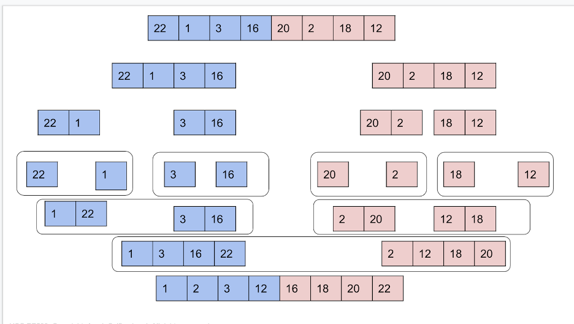

# HW5 EE599 - Computing Principles for Electrical Engineers

- Please clone the repository, edit [README.md](README.md) to answer the questions, and fill up functions to finish the hw.
- For non-coding quesitions, you will find **Answer** below each question. Please write your answer there.
- For coding questions, please make sure that your code can run ```bazel run/test```. In this homework, you will need to fill up [cpplib.cc](src/lib/cpplib.cc) and tests in [tests](tests).
- For submission, please push your answers to Github before the deadline.
- Deadline: Monday, September 21st by 23:59 pm
- Total: 130 points. 100 points is considered full credit.

## Question 1 (50 Points. Medium)

Please implement the following class for MaxHeap:
- Provide Gtest for methods that are marked with "GT".
```c++
class MaxHeap {
 public:
  MaxHeap(); // default constructor

  int getParentIndex(int i); //GT
  int getLeftIndex(int i); //GT
  int getRightIndex(int i); //GT
  int getLargestChildIndex(int i); //GT

  int getLeft(int i);
  int getRight(int i);
  int getParent(int i);

  int top(); //GT
  void push(int v); //GT
  void pop(); //GT
  void TrickleUp(int i);
  void TrickleDown(int i);

  vector<int> data_;
};
```

Write several tests using GTest for your function in [tests/q1_student_test.cc](tests/q1_student_test.cc).

Please create your test cases and run the following command to verify the functionality of your program.
```
bazel test tests:q1_student_test
```

## Question 2 (15 Points. Easy)

Write a function ```void heapSort(vector<int> &input)``` that uses heap-sort to sort a vector of integers.
- You should use std::priority_queue to implement your funciton.
- Provide time complexity for the function.

Example :
input: [5, 9, 3, 1, 7]
After calling the method, input changes to [1, 3, 5, 7, 9]

Write several tests using GTest for your function in [tests/q2_student_test.cc](tests/q2_student_test.cc).

Please create your test cases and run the following command to verify the functionality of your program.
```
bazel test tests:q2_student_test
```

## Question 3 (15 Points. Easy)

Write a function ```int findKthLargest(const vector<int> &input, int k)``` that finds the kth largest element in an unsorted vector and returns that value.
- You should do this without sorting the vector
- You can assume the input vector does not have duplicate values
- Provide time complexity for the function
- if k is invalid(eg: k <= 0), return -INX_MAX

Example:
input: [0, 2, 1, 5, 6, 3] and k = 2
output: 5

Write several tests using GTest for your function in [tests/q3student_test.cc](tests/q3_student_test.cc).

Please create your test cases and run the following command to verify the functionality of your program.
```
bazel test tests:q3_student_test
```

## Question 4 (30 Points. Easy)

We learn a few sorting algorithms in lecture, and picture below shows the order of dividing and merging in MergeSort:
<p align="center"></p>

Please create a similar image for sorting the letters in the following string in alphabetical order:
```
ilovecoding
```
To get full credit, please clearly specify when you are dividing and when you are merging and what two arrays are being merged. You can either attach an image OR text representation of your solution.


